# 蔚小芯智能体 · 学生操作手册

> **版本**：v3.0 · 2026-08-14
> **适用对象**：在校学生（尤其新生）、教师/管理员
> **正式入口**：`https://wxx-agent.online`（Web 端）；Android APK 见 2.11 节

---

## 第一篇 · 系统简介

### 1.1 蔚小芯是什么

**蔚小芯**是滁州学院计算机科学与工程学院（网络空间安全学院）建设的**智慧学工 AI 助手**。它将学校日常的办事流程、政策制度、学习生活、思政成长、心理健康等信息，通过大语言模型组织成"一问一答"的智能服务。学生直接向蔚小芯提问，就能得到**带来源、可追溯**的准确答复。

**一句话**：你的 24 小时校园 AI 学伴——不懂就问，办事直达，越用越懂你。

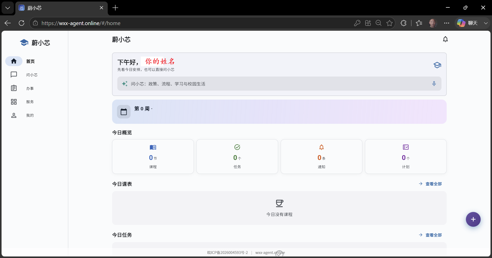

*图 1-1 蔚小芯界面总览*

### 1.2 核心能力

| 能力 | 说明 |
|------|------|
| 智能问答 | 检索增强生成（Context Engine），答案**附带知识来源**，可追溯、不编造 |
| 多智能体 | 政策、办事、心理、学科、通用 5 个专用智能体，可自由切换 |
| 越用越聪明 | 个性化推荐引擎，根据提问历史自动调整推荐 |
| 热门话题 | AI 自动聚合全校高频提问，生成热点标签与趋势 |
| 角色分级 | 学生、学生会、辅导员、教师、管理员各有专属能力 |
| 隐私保护 | 个人敏感信息仅本人、辅导员、管理员可见 |
| 多端可用 | Web + Android APK，微信小程序端开发中 |

### 1.3 功能全景

<table>
  <tr>
    <td align="center">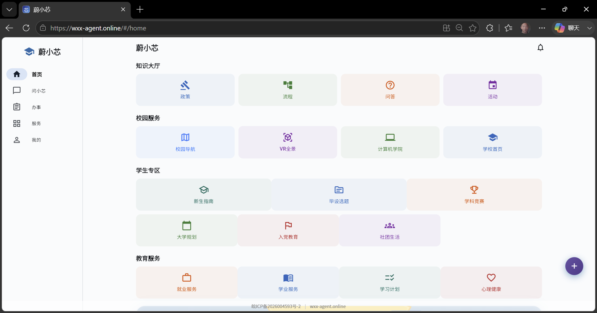</td>
    <td align="center">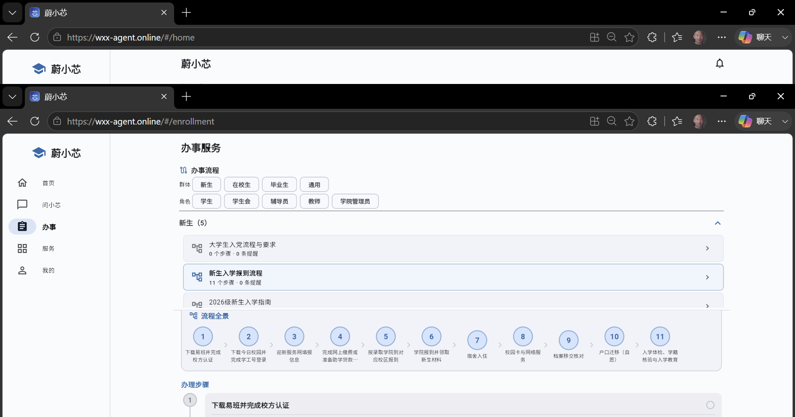</td>
  </tr>
  <tr>
    <td align="center"><em>学生首页</em></td>
    <td align="center"><em>学生办事</em></td>
  </tr>
  <tr>
    <td align="center">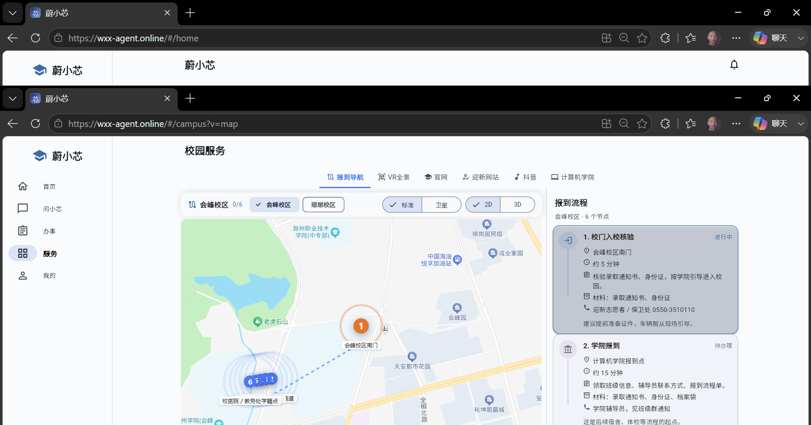</td>
    <td align="center">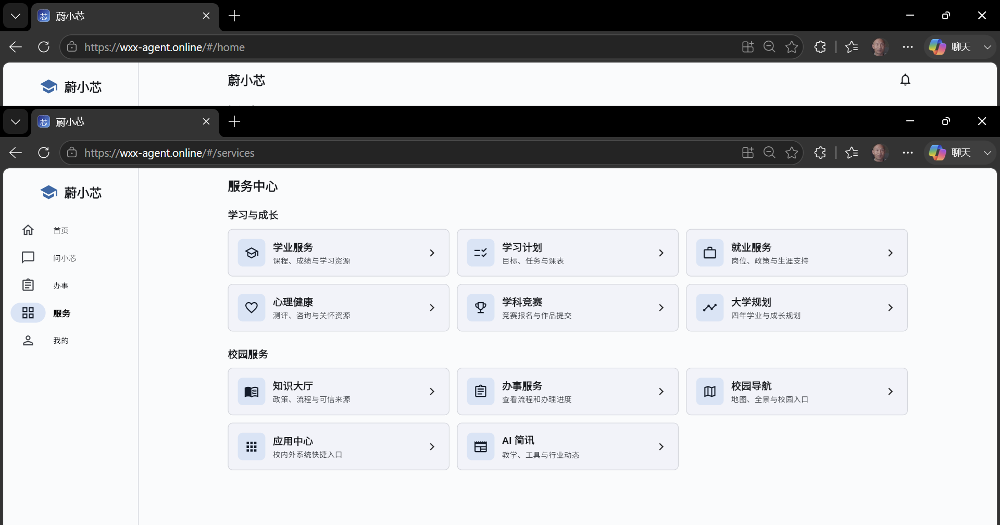</td>
  </tr>
  <tr>
    <td align="center"><em>校园导航</em></td>
    <td align="center"><em>个人中心</em></td>
  </tr>
</table>

*图 1-2 蔚小芯能力全景（学生端）*

---

## 第二篇 · 学生操作手册

> 新生首次使用，请按顺序完成：**访问 → 登录 → 改密 → 认识首页 → 对话 → 查看额度**。

### 2.1 访问系统

**方式一（推荐）**：浏览器打开 `https://wxx-agent.online`

**方式二（Android App）**：安装 APK（见 2.11 节）

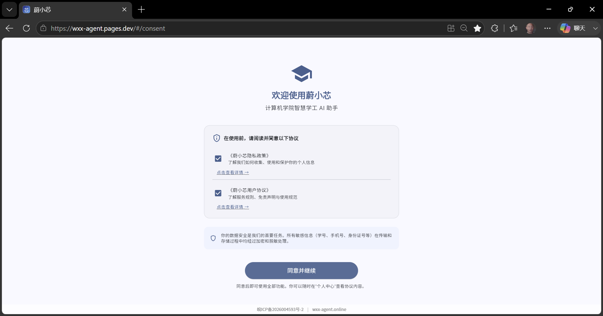

*图 2-1 访问系统*

> Web 与 App 使用同一套账号与数据，登录后操作一致。

### 2.2 登录

输入**学号**（账号）和**初始密码**（= 学号），点击登录。

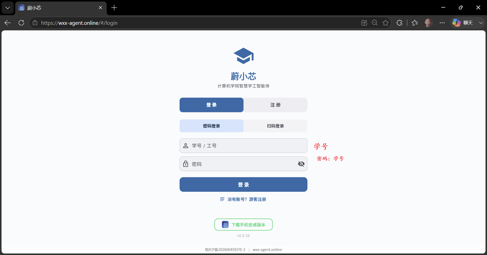

*图 2-2 登录界面*

> ⚠️ 初始密码等于学号，**登录后请立即修改**。

### 2.3 首次登录必须改密

首次登录系统自动弹出改密对话框，不可跳过。

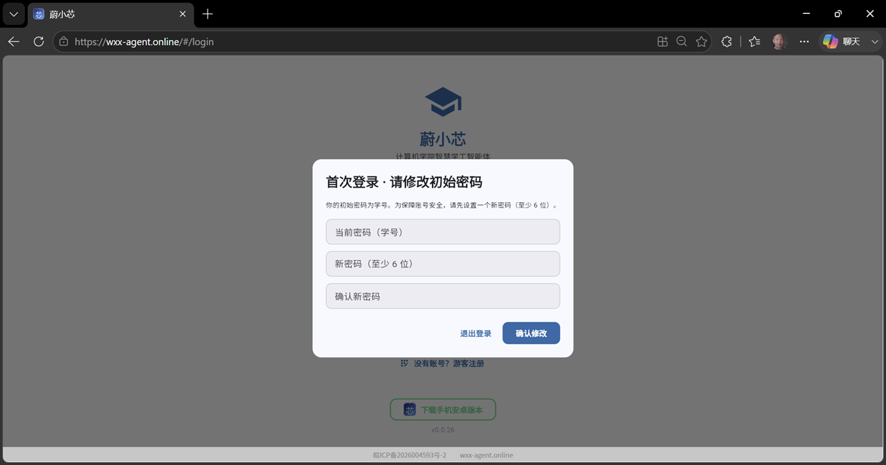

*图 2-3 首次登录强制改密*

| 输入项 | 填写 |
|--------|------|
| 当前密码 | 学号（初始密码） |
| 新密码 | 自行设置，≥6 位，建议字母+数字 |
| 确认新密码 | 再次输入新密码 |

- ✅ 改密成功 → 自动进入首页
- ❌ 点击退出 → 需重新登录完成改密
- 密码忘记 → 联系辅导员或管理员重置

### 2.4 认识首页

登录后进入首页：

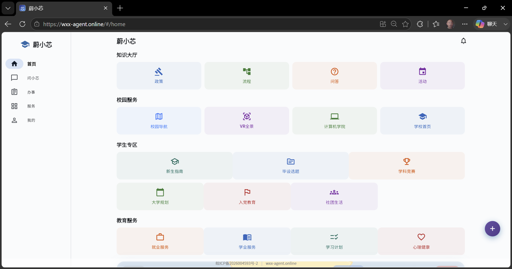

*图 2-4 首页与年级主题*

- **年级主题横幅**：大一「迎新」青绿、大二「追梦」蓝、大三「奋斗」橙、大四「创业」紫
- **今日速览卡**：今日课程、待办、天气、座右铭
- **底部导航**（手机端）：首页 / 问芯 / 办事 / 服务 / 我的
- **快捷功能**：学习打卡、办事流程等一键直达

### 2.5 智能体对话（问芯）

点击底部「问芯」，进入**多智能体对话**——蔚小芯的核心功能。

#### 选择智能体

对话页顶部有**智能体选择器**（水平滚动标签条），共 5 个专用智能体 + 默认协同模式：

| 智能体 | 适用场景 | 回答特点 |
|--------|----------|----------|
| 默认（协同） | 跨领域、不确定归类 | 自动路由到最合适智能体 |
| 政策解读 | 奖学金、学籍、转专业等政策 | 附政策原文来源，可追溯 |
| 流程指引 | 请假、报销、入党、毕业等手续 | 分步指引 + 材料清单 |
| 心理疏导 | 焦虑、压力、情感困扰 | 共情倾听，危机词自动转介 |
| 学科专业 | 专业方向、课程、竞赛 | 结合学院特色 |
| 通用问答 | 日常杂项、校园生活 | 兜底回答 |

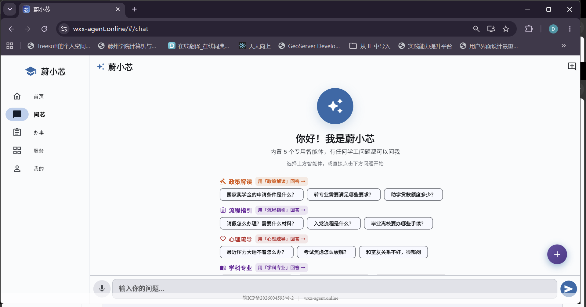

*图 2-5 智能体选择器*

> 选错也能回答，不确定用「默认」即可。

#### 提问技巧

- **说清意图**："国家奖学金的申请条件和截止时间"比"奖学金"更精准
- **带身份**：涉及个人事务时系统会结合你的身份给出个性化结果
- **一次一问**：复杂问题拆分，每步都能看到来源
- **善用追问**：回答末尾的「追问建议」可直接点击深挖

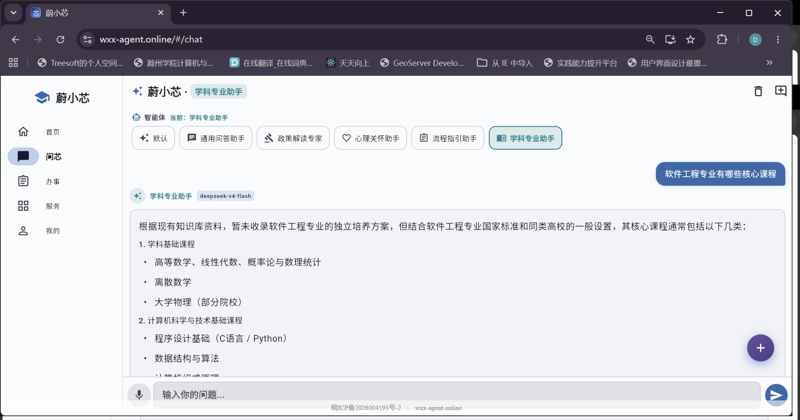

*图 2-6 智能体对话界面*

#### 看懂回答（AnswerCard）

| 区块 | 含义 |
|------|------|
| 结论 | 直接回答你的问题 |
| 步骤 | 办事流程分步指引 |
| 来源 sources | 知识库原文，**保证可追溯** |
| 追问建议 | 后续问题，点击继续深挖 |
| 操作按钮 | 复制 / 收藏 / 反馈 |

> 政策、流程类答案**必须带来源**，请以「来源」中的学校文件为准。

### 2.6 个性化推荐

首页「个性化推荐」卡片**根据你的提问历史自动调整**：问得多的方向推荐越精准，新同学看到当前热门内容兜底。用得越多，推荐越懂你。

### 2.7 特色功能

#### 学习生活

| 功能 | 入口 | 说明 |
|------|------|------|
| 今日速览 | 首页顶部 | 今天课程、待办、天气 |
| 学习打卡 | 学生 → 每日打卡 | 记录学习，积累积分 |
| 学习周报 | 学生 → 学习周报 | 每周学习自动汇总 |
| 数字孪生 | 学生 → 数字孪生 | AI 生成专属数字人形象 |
| 积分成就 | 学生 → 积分成就 | 学习积分 + 成就徽章 |

#### 思政成长

| 功能 | 说明 |
|------|------|
| 新生计划 | 入学成长路线图 |
| 政治学习 | 思政理论学习与自测 |
| 入党进度 | 入党全流程阶段追踪 |

#### 办事直达

点击底部「办事」，查看分步办理指引、材料清单、办理地点与联系方式。对话页也可直接提问。

### 2.8 AI 用量与个人 API Key

每位学生**每月 100,000 tokens**（管理员可调整），查看：我的 → AI 模型配置。

**额度用完？**

1. 等待下月重置
2. **绑定自己的 API Key**（推荐）：我的 → AI 模型配置 → 选择 DeepSeek / 智谱 → 填写 Key → 保存。绑定后**不消耗校内额度**。

> 获取 Key：DeepSeek `platform.deepseek.com` / 智谱 `open.bigmodel.cn`

### 2.9 我的（个人中心）

<table>
  <tr>
    <td align="center">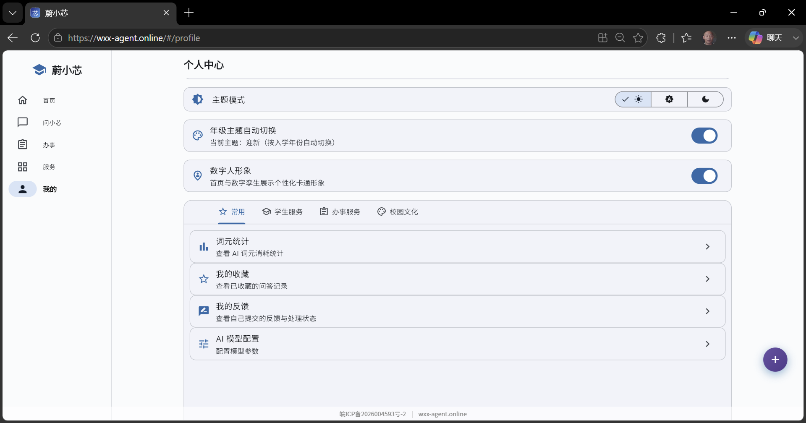</td>
    <td align="center">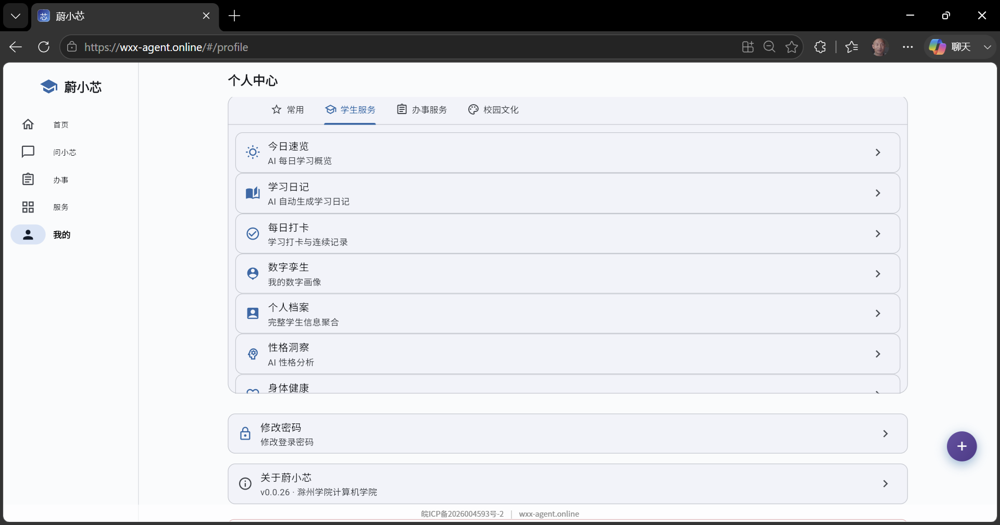</td>
  </tr>
  <tr>
    <td align="center"><em>个人中心</em></td>
    <td align="center"><em>设置选项</em></td>
  </tr>
  <tr>
    <td align="center">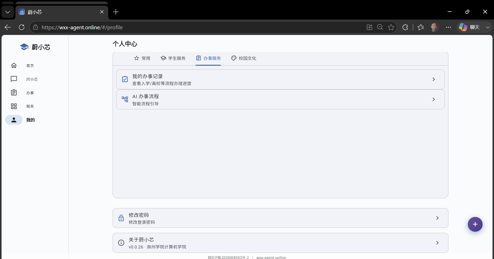</td>
    <td align="center">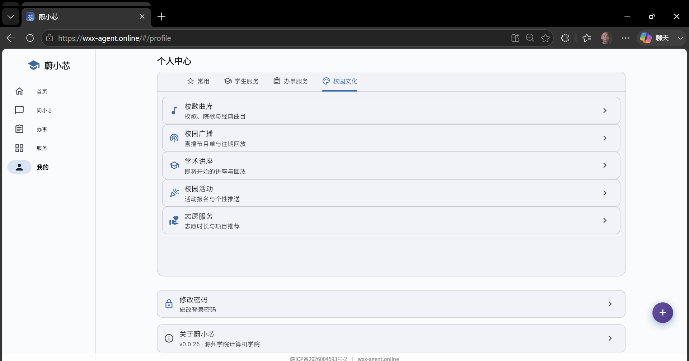</td>
  </tr>
  <tr>
    <td align="center"><em>AI 额度</em></td>
    <td align="center"><em>年级主题</em></td>
  </tr>
</table>

*图 2-7 我的（个人中心）*

| 入口 | 用途 |
|------|------|
| 个人信息 | 学号/姓名/学院/专业等（公共信息） |
| 我的反馈 | 查看反馈与处理状态 |
| AI 额度 | 查看用量、绑定个人 API Key |
| 修改密码 | 随时修改密码 |
| 年级主题 | 开启/关闭年级配色 |

### 2.10 悬浮菜单（快捷入口）

登录后每个页面**右下角**有可拖拽悬浮按钮（+ 号），点击展开快捷菜单：

<table>
  <tr>
    <td align="center">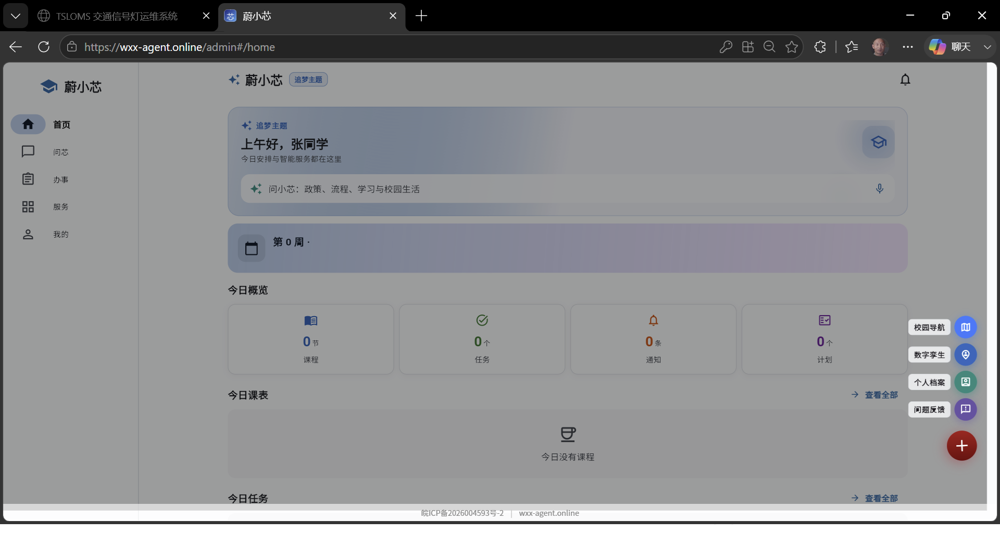</td>
    <td align="center"></td>
  </tr>
  <tr>
    <td align="center"><em>悬浮快捷菜单</em></td>
    <td align="center"><em>校园导航入口</em></td>
  </tr>
  <tr>
    <td align="center">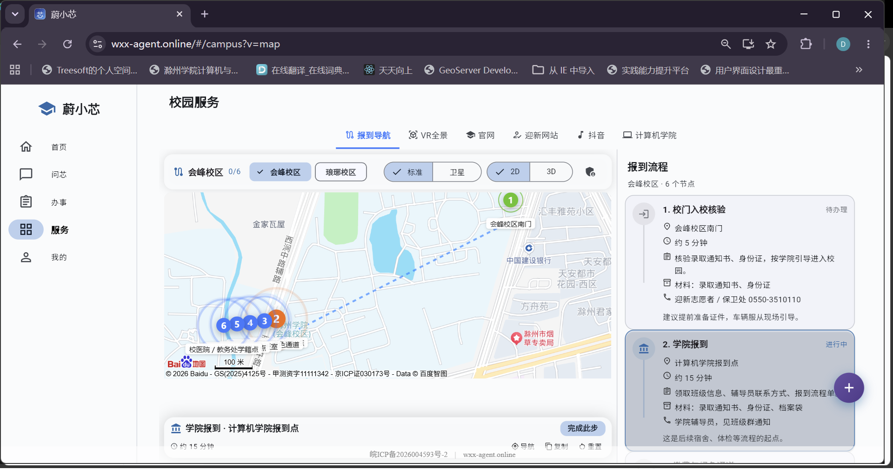</td>
    <td align="center">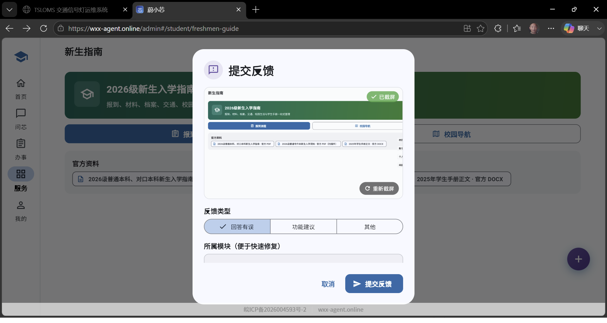</td>
  </tr>
  <tr>
    <td align="center"><em>数字孪生入口</em></td>
    <td align="center"><em>问题反馈入口</em></td>
  </tr>
</table>

*图 2-8 悬浮菜单与快捷入口*

| 功能 | 说明 |
|------|------|
| 问题反馈 | 一键截屏 + 分类 + 描述，快速上报 |
| 校园导航 | 打开校园地图 |
| 数字孪生 | 进入 AI 画像页 |
| 语音导航（手机端） | 自动开启语音输入 |

---

## 第三篇 · Android APK 安装

### 2.11 下载与安装

**下载方式**：

| 渠道 | 说明 |
|------|------|
| **班级网站**（推荐，速度快） | 从班级网站提供的下载链接直接下载 APK |
| **正式入口扫码** | 浏览器打开 `https://wxx-agent.online`，首页/登录页扫码下载（云服务器可能较慢） |

<table>
  <tr>
    <td align="center">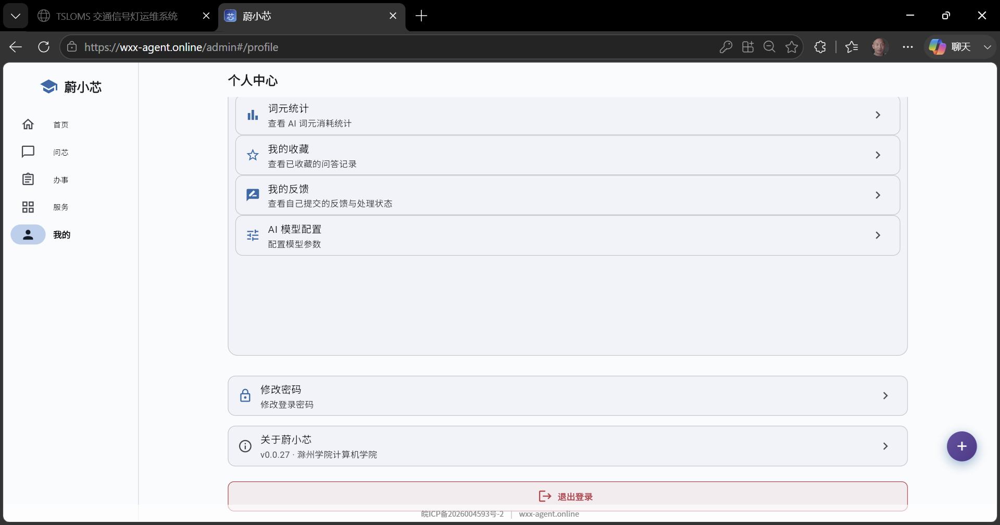</td>
    <td align="center">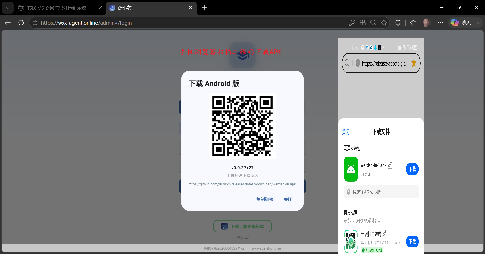</td>
    <td align="center">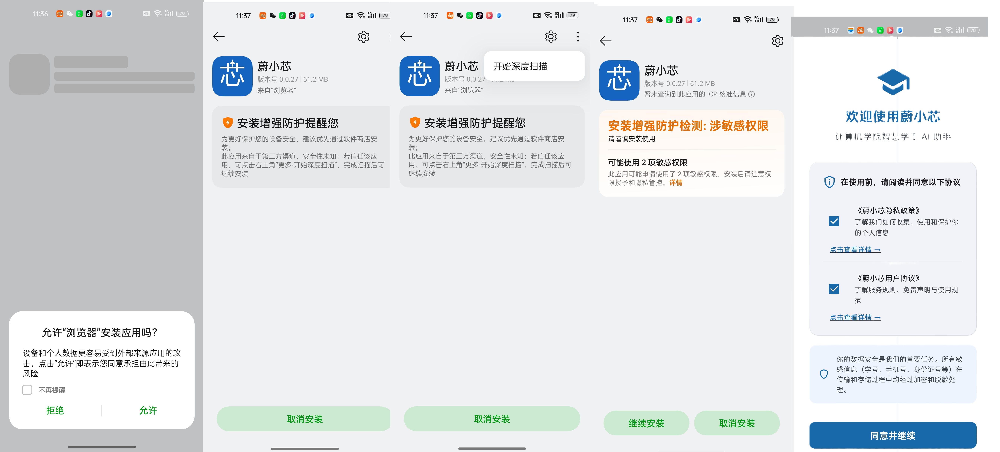</td>
  </tr>
  <tr>
    <td align="center"><em>步骤1：退出登录</em></td>
    <td align="center"><em>步骤2：扫码下载</em></td>
    <td align="center"><em>步骤3：安装应用</em></td>
  </tr>
</table>

**安装步骤**：

1. 从班级网站或扫码下载 APK 文件
2. 点击安装，若提示「未知来源应用」，在设置中允许安装
3. 安装完成后打开「蔚小芯」图标
4. 输入**学号 + 密码**登录（首次需改密）

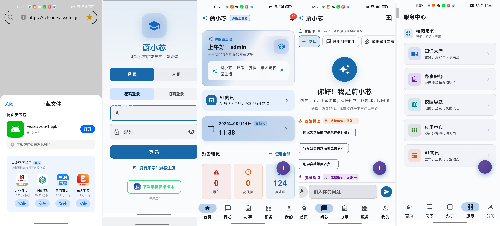

*图 2-10 使用 APK 登录*

| 事项 | 说明 |
|------|------|
| 版本升级 | 下载新版 APK 安装即覆盖 |
| 数据同步 | App 与 Web 实时同步 |
| 系统要求 | Android 8.0 及以上 |

---

## 第四篇 · 常见问题

| 问题 | 解答 |
|------|------|
| 登录提示"账号或密码错误"？ | 检查学号是否正确；确认用新密码登录 |
| 忘记密码？ | 联系辅导员或管理员重置 |
| 回答有误怎么办？ | 点击回答下方「反馈」纠错，管理员会修复 |
| AI 额度用完？ | 等下月重置，或绑定自己的 API Key（见 2.8 节） |
| Web 打开空白？ | 强制刷新（Ctrl+F5）或清除缓存 |
| 私密信息别人能看到吗？ | 不会，仅本人/辅导员/管理员可见 |

---

## 附录 · 图目录

| 图号 | 图名 |
|------|------|
| 图 1-1 | 蔚小芯界面总览 |
| 图 1-2 | 蔚小芯能力全景 |
| 图 2-1 | 访问系统 |
| 图 2-2 | 登录界面 |
| 图 2-3 | 首次登录强制改密 |
| 图 2-4 | 首页与年级主题 |
| 图 2-5 | 智能体选择器 |
| 图 2-6 | 智能体对话界面 |
| 图 2-7 | 我的（个人中心） |
| 图 2-8 | 悬浮菜单与快捷入口 |
| 图 2-9 | 使用 APK 登录 |
