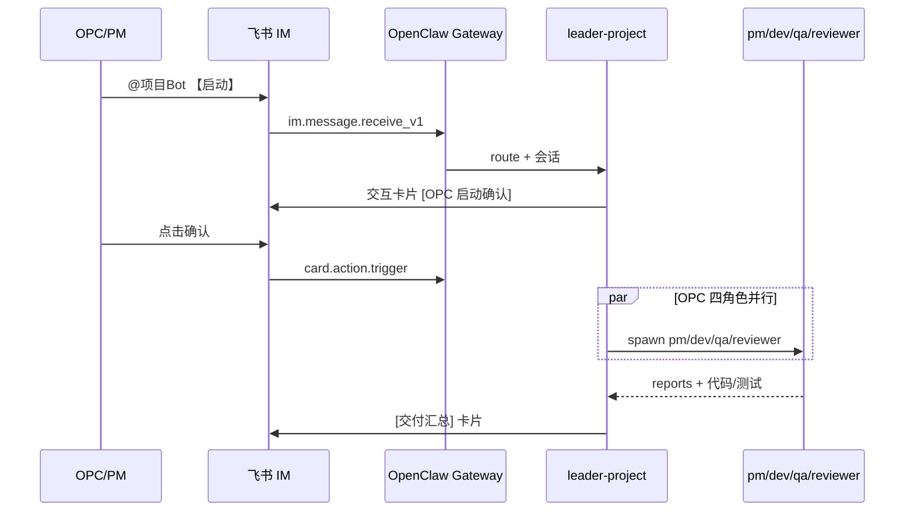

# 飞书-OpenClaw-多模型-多工具-OPC实现方案软件报告

> 文档状态：软件下载、安装、配置、使用与验收指南
> 
> 编制日期：2026-08-30
> 
> 适用范围：WXX、VOPC、GPPS、EQS、AFC、QFH 多项目独立 OPC 开发链路
> 
> 安全原则：本文不记录 App Secret、API Key、Token、密码或其他真实凭据。

## 1. 报告目的

本报告根据《飞书-OpenClaw-多模型-多CLI工具-OPC实现方案总结报告》和各项目方案，说明从零开始搭建以下软件链路的方法：

```text
Feishu
  → OpenClaw Gateway
  → 项目 Agent
  → 项目指定大模型
  → CLI / 多工具
  → 独立 workspace
  → OPC 项目开发、测试与审查
```

报告覆盖软件获取、Windows 安装、基础配置、项目隔离、模型配置、飞书接入、CLI 使用、OPC 协作、验证、故障排查和安全边界。

## 2. 软件清单

| 软件或服务 | 用途 | 获取方式 | 本方案要求 |
|---|---|---|---|
| Windows 10/11 | 运行环境 | Microsoft 官方渠道 | 使用同一 Windows 用户安装和运行 |
| Node.js LTS | 运行 OpenClaw、JavaScript 工具和部分项目 | Node.js 官方网站：https://nodejs.org/ | 安装后核对 `node --version`、`npm --version` |
| npm | Node.js 包管理器 | 随 Node.js 安装 | 使用项目锁文件和官方 registry |
| OpenClaw CLI/Gateway | Feishu 接入、Agent 路由、会话和工具编排 | OpenClaw 官方文档：https://docs.openclaw.ai/；项目发布渠道 | 本机已核验版本：`2026.7.1-2` |
| Feishu/Lark 开放平台 | 创建机器人 App、配置事件和发布应用 | https://open.feishu.cn/ | 每个项目独立 App、App ID 和 accountId |
| Git | 版本控制、diff、提交和回滚 | https://git-scm.com/ | 每个项目在自身仓库边界内操作 |
| CodeX CLI | WXX 等项目的代码阅读、计划、实现和检查 | 以组织批准的官方发行渠道为准 | 先计划和人工确认，再编码 |
| Claude CLI | VOPC 项目代码协作 | 以 Anthropic 官方渠道和组织授权为准 | 仅在 VOPC workspace 使用 |
| Gemini CLI | GPPS 项目代码协作 | 以 Google 官方渠道和组织授权为准 | 仅在 GPPS workspace 使用 |
| DeepSeek CLI/模型工具 | EQS 项目代码协作 | 以 DeepSeek 官方渠道和组织授权为准 | 仅在 EQS workspace 使用 |
| Kimi/Kimi-K3 工具链 | QFH 项目代码协作 | 以 Moonshot/Kimi 官方渠道和组织授权为准 | 目标引用：`kimi-k3/kimi-k3` |
| GLM 工具链 | AFC 项目文本和代码协作 | 以智谱官方渠道和组织授权为准 | 目标引用：`glm-53-flash/glm-5.3-flash` |
| Python | 静态服务、辅助脚本或项目工具 | Python 官方网站：https://www.python.org/ | 只按项目文档安装，不把本地 Mock 当生产服务 |
| Flutter SDK | WXX 客户端开发 | Flutter 官方网站：https://flutter.dev/ | 仅 WXX 使用，按 WXX 文档锁定版本 |
| Go | WXX 后端开发 | Go 官方网站：https://go.dev/ | 仅 WXX 后端使用，按 `go.mod` 版本执行 |
| 微信开发者工具 | AFC 微信小程序开发和云函数部署 | 微信官方开发者工具渠道 | 外部部署和真实调用需要人工确认 |

### 2.1 下载原则

1. 优先使用软件官网、官方文档或组织批准的镜像；不从不明网盘、破解站或来历不明的 npm 包下载。
2. 安装包下载后核对版本、发布者和校验和；企业环境应保留软件清单和安装记录。
3. CLI 的登录、授权和模型可用性必须在实际运行 Gateway 的同一 Windows 用户环境检查。
4. 模型名称只是产品名称，不等于 Provider、模型 ID、Base URL 或 API 类型。
5. 不在报告、Git、飞书消息、截图和日志中粘贴真实密钥。

## 3. 安装顺序

### 3.1 安装基础运行环境

以 PowerShell 打开终端，安装 Node.js LTS、Git 以及项目实际需要的 Python、Go、Flutter。安装后执行：

```powershell
node --version
npm --version
git --version
python --version
go version
flutter --version
```

不需要的运行时不要为了“完整”而安装。WXX、AFC、QFH 等项目的依赖按各自 README 和 `package.json` 执行。

### 3.2 安装 OpenClaw

通过组织批准的 OpenClaw 官方安装方式安装 CLI。安装后确认：

```powershell
openclaw --version
openclaw status
```

本机既有 Gateway 应优先复用，不得为任何项目启动第二个 Gateway。当前目标是保持唯一实例监听：

```text
127.0.0.1:18789
```

Gateway 可以使用 Windows Scheduled Task 常驻。修改配置、安装插件或变更模型后，按 OpenClaw 官方生命周期方式 reload/restart 现有实例；不得用第二个临时进程绕过配置问题。

### 3.3 安装项目依赖

进入具体项目目录执行项目文档规定的安装命令。例如 QFH：

```powershell
cd E:\2026-2027\2026-2027-1\MyProjects\qfh
npm install
npm run build
npm test
```

QFH 当前数据层为内存实现，重启会丢失数据；这只能用于本地闭环演示，不能当作生产数据库。

WXX、VOPC、GPPS、EQS、AFC 分别进入各自项目目录，不得在一个项目目录中混装或运行另一个项目的依赖。

## 4. OpenClaw 基础配置

主配置文件：

```text
C:\Users\ldl\.openclaw\openclaw.json
```

### 4.1 配置修改前检查

```powershell
openclaw config get gateway
openclaw agents list
openclaw status
```

修改前必须备份：

```powershell
Copy-Item C:\Users\ldl\.openclaw\openclaw.json C:\Users\ldl\.openclaw\openclaw.json.bak-<日期时间>
```

配置文件是 JSON5 时，不能使用原生 `JSON.parse` 作为读取或转换方式，也不能整体重写文件。应按 OpenClaw JSON5 schema 做最小增量修改，并在修改后执行：

```powershell
openclaw config validate
```

### 4.2 Gateway 配置

所有项目共用一个 Gateway：

```text
模式：local
地址：127.0.0.1
端口：18789
实例数：1
```

检查重点：

- 监听地址和端口没有冲突；
- Scheduled Task 只注册一个 Gateway；
- Gateway connectivity probe 通过；
- 不因单个项目故障启动第二实例；
- 需要重载时重载现有实例，而不是 stop + start 两个不同进程。

## 5. 多项目独立配置

### 5.1 统一资源规则

每个项目必须同时具备：

- 独立 Feishu App 和 App ID；
- 独立 Feishu `accountId`；
- 独立 `leader-<project>` 和子 Agent；
- 独立 Provider/Model；
- 独立 workspace；
- 独立会话键和会话历史；
- 独立 Feishu route；
- 独立 CLI 授权和 OPC 操作边界。

通用 Skill 只提供流程，不绑定任何项目资源。当前唯一通用 Skill 名称为：

```text
feishu-openclaw-agent-model-tool-opc
```

### 5.2 项目资源表

| 项目 | Feishu account | 主 Agent | 目标模型 | 项目 workspace |
|---|---|---|---|---|
| WXX | `default` | `leader-wxx` | WXX 既有 GPT 链路 | `E:\2026-2027\2026-2027-1\MyProjects\wxx` |
| VOPC | `claude-vopc` | `leader-vopc` | Claude | `E:\2026-2027\2026-2027-1\MyProjects\vopc` 及其专属 workspace |
| GPPS | `gemini-gpps` | `leader-gpps` | Gemini | `E:\2026-2027\2026-2027-1\MyProjects\gpps` 及其专属 workspace |
| EQS | `deepseek-eqs` | `leader-eqs` | `deepseek-openclaw/deepseek-v4-flash` | `E:\2026-2027\2026-2027-1\MyProjects\eqs` 及其专属 workspace |
| AFC | `glm-afc` | `leader-afc` | `glm-53-flash/glm-5.3-flash` | `E:\2026-2027\2026-2027-1\MyProjects\afc\.openclaw\workspaces` |
| QFH | `kimi-qfh` | `leader-qfh` | `kimi-k3/kimi-k3` | `E:\2026-2027\2026-2027-1\MyProjects\qfh\.openclaw\workspaces` |

### 5.3 Agent 和 workspace

建议每个项目至少配置以下角色：

```text
leader-<project>
pm-<project>
dev-refactor-<project>
qa-regression-<project>
reviewer-audit-<project>
```

职责边界：

- `leader`：读取需求、制定计划、拆分任务、汇总结果和控制变更；
- `pm`：需求、范围、优先级、验收标准和发布说明；
- `dev-refactor`：实现代码和必要重构；
- `qa-regression`：测试、回归、失败复现和证据记录；
- `reviewer-audit`：审查安全、边界、diff、依赖和发布风险。

多个 Agent 不得同时修改同一文件。workspace 必须位于对应项目目录边界内，不得把 AFC Agent 指向 VOPC workspace，也不得让 QFH 使用其他项目的会话目录。

## 6. Feishu App 下载、配置和使用

### 6.1 创建 App

在 Feishu 开放平台：

1. 创建一个项目专属机器人 App；
2. 保存 App ID；
3. 在本机安全位置填写 App Secret；
4. 按 [6.1.1](#611-配置原则与-openclaw-架构对应) 至 [6.1.7](#617-配置实施清单) 配置机器人能力、事件订阅和必要权限；
5. 发布应用；
6. 将机器人加入测试群；
7. 只在测试群进行模型身份和最小功能探针。

App Secret 不通过聊天传递。未安全填写真实 Secret 时，账号保持 `enabled: false`；已确认真实 Secret 有效并完成接入准备后，才允许改为 `enabled: true`。

#### 6.1.1 配置原则与 OpenClaw 架构对应

本方案采用 **「每项目一个 Feishu App + 一个 OpenClaw accountId」**，而非 TRAE 方案中的 7 个专用 Bot。飞书机器人是 **项目入口与通知层**；OpenClaw Gateway 负责 **路由、会话、Agent 编排与模型调用**。

```text
飞书群 @项目 Bot
  → OpenClaw Gateway（127.0.0.1:18789）
  → Feishu/<accountId> route
  → leader-<project>（总控）
  → pm / dev-refactor / qa-regression / reviewer-audit（OPC 四角色，Gateway 内编排）
  → 项目 Provider/Model + workspace + CLI
```

| 层级 | 组件 | 飞书侧职责 | OpenClaw 侧职责 |
|---|---|---|---|
| 入口 | 项目 Bot（1 App/项目） | 接收 @消息、推送卡片与通知 | accountId、route、`requireMention` |
| 总控 | `leader-<project>` | 汇总卡片、里程碑通知 | 任务拆分、spawn 子 Agent、集成验收 |
| OPC 四角色 | pm / dev / qa / reviewer | 可选 Docx/Base 沉淀 | 独立 Agent、独立 workspace 边界 |
| 模型与工具 | — | 不直接暴露 | Provider/Model、CLI、Skill |

**最小权限原则**：飞书 App 只开 OPC 协作链实际用到的能力；代码读写、测试执行、模型调用均在 OpenClaw workspace 内完成，不通过飞书 API 写源码。

#### 6.1.2 飞书能力矩阵（按项目 Bot）

每个项目 Bot 启用下列能力子集；下表「必选」为端到端验收最低集，「推荐」为 PM/发布流程增强，「按需」仅在项目明确使用时开启。

| 飞书能力 | OpenClaw/OPC 映射 | 使用场景 | 建议级别 |
|---|---|---|---|
| **IM 即时通讯** | 项目入口、`leader` 对话、子 Agent 结果通知 | @机器人发任务、探针、进度卡片、告警 | **必选** |
| **交互卡片 Card** | 任务确认、验收、审批按钮 | 【启动】确认、发布审批、人工确认门禁 | **必选** |
| **云文档 Docx** | `pm-<project>` 交付物 | PRD、技术方案、验收报告链接 | 推荐 |
| **多维表格 Base** | PM 看板、QA 缺陷表 | 任务状态、缺陷跟踪、里程碑 | 推荐 |
| **知识库 Wiki** | CDO 归档、`docs/` 对外镜像 | 规范、接口文档、发布说明 | 按需 |
| **日历 Calendar** | 部署窗口、里程碑 | 发布排期、评审日程 | 按需 |
| **任务 Task** | PM 待办分派 | 人工待办、OPC 确认项 | 按需 |
| **审批 Approval** | 发布/密钥/生产变更门禁 | 高风险操作人工批准 | 按需 |
| **妙记 Minutes** | CSO 纪要 | 会议要点、待办（非代码路径） | 按需 |
| **事件监听 Event** | Webhook 回调 | 消息、卡片、审批、Base 变更 | **必选** |
| **云空间 Drive** | 附件、截图 | 测试截图、构建日志附件 | 按需 |

**与 TRAE 7-Bot 方案差异**：TRAE 为每个子智能体单独建 Bot；OpenClaw 方案中 **一个项目 Bot 承担全部 IM 入口**，子 Agent 编排由 Gateway 完成，飞书 Docx/Base/Wiki 仅作 **人的协作与留痕层**。

#### 6.1.3 必要权限 scope（按角色分组）

在飞书开放平台「权限管理」中按组开通；scope 名称以开放平台当前文档为准。下表按 **项目 Bot 统一授权**，并按 OPC 角色标注主要使用者。

**A. 基础 IM（必选，所有项目 Bot）**

| scope | 用途 | 主要角色 |
|---|---|---|
| `im:message` | 读取群聊/单聊消息（@触发） | Gateway 路由 |
| `im:message:send_as_bot` | 以机器人身份回复与推送 | leader、全部通知 |
| `im:chat:readonly` | 读取群信息（群 ID、成员） | 路由与探针 |
| `im:resource` | 上传图片/文件到消息 | 测试截图、日志摘要 |

**B. 事件与回调（必选）**

| scope | 用途 | 主要角色 |
|---|---|---|
| （事件订阅本身不单独占 scope，但需 App 具备对应能力的读/写权限） | — | — |
| 卡片回调依赖 IM 发送权限 | 按钮「确认/驳回/【启动】」 | leader、OPC 人工确认 |

**C. 文档与协作（推荐，PM/QA 留痕）**

| scope | 用途 | 主要角色 |
|---|---|---|
| `docx:document` | 创建/读取/更新云文档 | pm、leader 汇总 |
| `docx:document:readonly` | 只读引用需求文档 | dev、qa、reviewer（若走飞书读 PRD） |
| `drive:drive:readonly` | 读取云空间文件链接 | 全员通知中的附件 |
| `wiki:wiki:readonly` | 读取知识库页面 | 规范引用 |
| `wiki:wiki` | 创建/更新 Wiki 页面 | CDO 归档（按需） |

**D. 多维表格（推荐，PM/QA）**

| scope | 用途 | 主要角色 |
|---|---|---|
| `base:app:readonly` | 读取任务/缺陷表 | pm、qa |
| `base:record:readonly` | 读取记录 | leader 进度汇总 |
| `base:record` | 创建/更新任务或缺陷行 | pm、qa（**仅在有 Base 集成时**） |

**E. 发布与治理（按需，高风险门禁）**

| scope | 用途 | 主要角色 |
|---|---|---|
| `approval:approval:readonly` | 查询审批状态 | leader、DevOps 流程 |
| `approval:approval` | 发起发布/变更审批 | leader（OPC 批准前） |
| `calendar:calendar:readonly` | 读取部署窗口 | pm |
| `calendar:calendar` | 创建里程碑/评审日程 | pm（按需） |
| `task:task:readonly` | 读取任务 | pm 助手 |
| `task:task` | 创建 OPC 待办 | pm（按需） |
| `minutes:minutes:readonly` | 读取妙记 | CSO（按需） |

**禁止开通（本方案不需要）**：通讯录全量导出、邮件代发、无关业务 API、超出项目边界的 Admin 类权限。

#### 6.1.4 事件订阅清单

在飞书开放平台「事件订阅」中配置 **请求地址** 指向 OpenClaw Gateway 的 Feishu Webhook（由 OpenClaw 插件/通道文档指定，通常为 Gateway 暴露的 HTTPS 回调或内网穿透地址）。订阅以下事件：

**必选事件（所有项目 Bot）**

| 事件 | event_type | 触发场景 | Gateway/OpenClaw 动作 |
|---|---|---|---|
| 接收消息 | `im.message.receive_v1` | 群内 @机器人、单聊消息 | 解析 accountId → route → leader Agent |
| 消息已读 | `im.message.message_read_v1` | 可选，用于已读回执 | 一般可不处理 |
| 机器人入群 | `im.chat.member.bot.added_v1` | Bot 加入测试群 | 发送欢迎与探针说明 |
| 机器人出群 | `im.chat.member.bot.deleted_v1` | Bot 被移出群 | 记录日志，暂停该群路由 |
| 卡片按钮回调 | `card.action.trigger` | 【启动】确认、验收、审批按钮 | 回调 OpenClaw 继续/中止任务 |

**推荐事件（有 Base/审批集成时）**

| 事件 | event_type | 触发场景 | 动作 |
|---|---|---|---|
| 审批实例状态变更 | `approval.approval_updated_v4` | 发布审批通过/驳回 | 通过 → 允许 leader 继续部署；驳回 → 通知 OPC |
| 多维表格记录变更 | `drive.file.bitable_record_changed_v1` | 缺陷/任务行状态变更 | 同步 PM 看板，可选通知 qa/dev |
| 云文档评论 | `comment.comment.updated_v1` | PRD 评审评论 | 可选通知 pm（按需） |

**OpenClaw 侧配置要点**

```text
requireMention: true          # 群聊必须 @，避免误触发
encryptKey / verificationToken # 按开放平台填写，不写进本文档
accountId 与 App ID 一一对应   # 见 5.2 项目资源表
enabled: false → true          # Secret 有效且事件验证通过后再启用
```

#### 6.1.5 触发条件 → 消息模板 → 飞书能力对照表

下表描述 **OpenClaw OPC 工作流** 中常见触发点；消息由 **项目 Bot** 发送，编排由 **leader 与子 Agent** 完成。

| 触发条件 | 消息类型 | 消息模板（标题/要点） | 飞书能力 | OpenClaw 对应 |
|---|---|---|---|---|
| OPC/PM 在群内 @Bot 发送【启动】 | 交互卡片 | `[OPC 启动确认]` 项目名、目标、workspace、允许修改范围；按钮：确认启动 / 取消 | IM + Card | leader 读取 docs，spawn 四角色 |
| 用户 @Bot 发送模型身份探针 | 文本/卡片 | `[模型探针]` accountId、Agent、Provider/Model、fallback 状态 | IM | route 命中验证 |
| leader 完成四角色汇总 | 交互卡片 | `[交付汇总]` 四报告路径、测试/构建结果、风险；按钮：OPC 验收 / 退回修复 | IM + Card + Docx 链接 | `reports/*-final-summary` |
| pm 输出验收清单 | 文本/卡片 | `[PM 验收标准]` 条目数、blocked 项、Docx 链接 | IM + Docx | pm-`<project>` |
| dev 完成实现 | 交互卡片 | `[开发完成]` 变更摘要、diff 范围、dev-notes 链接；按钮：请求 QA | IM + Docx | dev-refactor-`<project>` |
| qa 测试失败 | 交互卡片 | `[测试失败]` 失败用例数、日志摘要；按钮：指派修复 / 忽略（需 OPC） | IM + Base 行 | qa-regression-`<project>` |
| qa 测试通过 | 文本/卡片 | `[测试通过]` 通过率、报告链接 | IM + Docx | qa-report |
| reviewer 发现高风险 | 交互卡片 | `[审计告警]` 等级、项数、audit-report 链接；按钮：阻塞发布 | IM + Docx | reviewer-audit-`<project>` |
| 请求发布/生产变更 | 交互卡片 | `[发布审批]` 影响范围、回滚点；按钮：提交审批 | IM + Approval | OPC 人工确认门禁 |
| 审批通过 | 文本 | `[审批已通过]` 实例 ID、下一步动作 | IM + Approval 事件 | leader 继续部署 |
| Gateway/模型异常 | 文本 | `[运行告警]` 错误类型、accountId、是否 fallback | IM | 运维排查 |
| 定时进度（可选） | 卡片 | `[进度心跳]` 任务完成率、blocked 列表 | IM + Base | PM 监控 |

**卡片回调 value 建议（示例键名，不含密钥）**

```json
{
  "action": "opc_start_confirm",
  "project": "vopc",
  "task_id": "<uuid>",
  "account_id": "claude-vopc"
}
```

```json
{
  "action": "release_approve",
  "project": "qfh",
  "version": "<semver>",
  "rollback_tag": "<git-tag>"
}
```

#### 6.1.6 群聊拓扑与事件流转

**群聊拓扑（每项目）**

| 群聊 | 成员 | 用途 |
|---|---|---|
| **`<project>`-opc-测试群** | OPC + PM + 项目 Bot | 唯一入口：@Bot、探针、端到端验收 |
| **`<project>`-opc-通知群**（可选） | PM + 项目 Bot | 仅里程碑/告警，减少测试群噪音 |
| **组织级 opc-总群**（可选） | OPC + 各项目 PM | 跨项目状态心跳，不混用 accountId |

**禁止**：多个项目共用一个 Feishu App；同一 App 绑定多个 accountId；在生产群关闭 `requireMention`。

**事件流转（端到端）**

```text
1. 用户在测试群 @项目Bot + 消息体
2. 飞书 → im.message.receive_v1 → OpenClaw Gateway
3. Gateway 校验签名 → 匹配 Feishu/<accountId> → leader-<project>
4. leader 解析指令：
     - 探针 / 只读查询 → 直接回复
     - 【启动】→ 发确认卡片 → card.action.trigger → spawn 四 Agent
5. 子 Agent 在 workspace 内工作（不经过飞书 API 写代码）
6. leader 汇总 → IM 卡片 + Docx/Base 链接（若已配置）
7. 高风险 → Approval 事件 → OPC 确认 → 继续或中止
```



#### 6.1.7 配置实施清单

| 序号 | 配置项 | 负责人 | 前置条件 | 产出 |
|---|---|---|---|---|
| 1 | 为 WXX/VOPC/GPPS/EQS/AFC/QFH 各创建 1 个自建应用 | OPC | 飞书管理员权限 | 6 个 App ID（Secret 本地保管） |
| 2 | 开通 [6.1.3](#613-必要权限-scope按角色分组) 中必选 scope | OPC | 应用已创建 | 权限审批通过 |
| 3 | 配置事件订阅 [6.1.4](#614-事件订阅清单) 并验证 URL | OPC | Gateway/Webhook 可达 | 事件推送成功 |
| 4 | 在 `openclaw.json` 填写 accountId、App ID、SecretRefs | OPC | config validate 通过 | `enabled: false` 待验收 |
| 5 | 创建 `<project>-opc-测试群` 并拉入 Bot | PM | 应用已发布 | Bot 在群内 |
| 6 | （推荐）创建 Docx 模板 + Base 看板/缺陷表 | PM | docx/base 权限 | 链接写入项目 docs |
| 7 | （按需）配置 Approval 发布流程 | OPC | 审批定义就绪 | 审批模板 ID |
| 8 | 导入/约定交互卡片 JSON 模板 | OPC | 卡片字段与 action 键一致 | 启动/汇总/审批 3 套 |
| 9 | 执行只读模型探针 + 低风险问答 | PM + OPC | `enabled: true` | accountId/Model 证据 |
| 10 | 【启动】端到端：四报告 + final-summary | OPC | 9 通过 | 项目接入完成 |

**验收证据（每个项目单独留存）**

```text
[ ] 事件订阅验证通过（im.message.receive_v1）
[ ] @Bot 命中正确 Feishu/<accountId>
[ ] 探针返回正确 Provider/Model，无未声明 fallback
[ ] 【启动】卡片回调可 spawn 四角色（或记录 OpenClaw 等价行为）
[ ] 汇总卡片含 reports 路径与测试摘要
[ ] 未开通多余 scope；Secret 未出现在 Git/文档/聊天
```

### 6.2 accountId 与 route

命名必须在账号、显示名、route、探针和报告中保持一致。例如：

```text
AFC：Feishu/glm-afc → leader-afc
QFH：Feishu/kimi-qfh → leader-qfh
```

群聊默认：

```text
requireMention: true
```

修改 accountId 时，必须同时搜索并更新旧 accountId、旧 route、旧会话说明和验收命令；只改显示名是不完整修改。

### 6.3 Feishu 使用流程

1. 在测试群中明确 `@机器人`；
2. 先发送只读模型身份探针；
3. 确认命中的 accountId 和 Agent；
4. 确认运行元数据中的 Provider、Model 和 fallback 状态；
5. 再发送低风险项目查询；
6. 代码修改任务必须回到项目工作流：读取、计划、人工确认、编码、测试、diff。

通道显示 `connected/works` 只证明连接层，不等于路由命中、模型可用或端到端成功。

## 7. 多模型和 CLI 配置

### 7.1 配置四层

模型接入至少包含四层，必须逐层一致：

```text
Provider
  → Model ID
  → Agent model/models
  → Feishu route 命中的 Agent
```

还必须额外验证：

- Gateway 运行态实际配置；
- 会话首条 `model_change`；
- 真实请求的 Provider/Model 元数据；
- 是否发生 fallback。

### 7.2 项目模型

| 项目 | Provider/Model 引用 | 使用重点 |
|---|---|---|
| WXX | 以当前 WXX 配置为准 | 结构化知识、sources 可追溯、Context Engine 和 CodeX CLI |
| VOPC | 以 `claude-vopc` 项目配置为准 | 代码理解、重构、审查和 OPC 协作 |
| GPPS | 以 `gemini-gpps` 项目配置为准 | Gemini CLI、多文件分析和项目开发 |
| EQS | `deepseek-openclaw/deepseek-v4-flash` | DeepSeek CLI 与 EQS 独立开发链路 |
| AFC | `glm-53-flash/glm-5.3-flash` | GLM 文本调用、AFC 业务分析和受控云函数 |
| QFH | `kimi-k3/kimi-k3` | 长上下文、代码理解、跨模块分析和结构化输出 |

### 7.3 CLI 通用使用流程

在目标项目根目录或明确的项目 workspace 中启动对应 CLI：

```text
1. 确认当前目录和项目 Agent。
2. 阅读 AGENTS.md、README 和相关 docs。
3. 说明目标、影响范围、假设和风险。
4. 输出变更计划。
5. 获得人工确认后再编码或执行写操作。
6. 运行测试、类型检查、Lint、构建或最小验证。
7. 检查 git diff、敏感信息和越界文件。
8. 提交可回滚变更，并记录验证证据。
```

禁止把 CLI 的模型自报、通道 connected 或“命令没有报错”当作完整验收证据。

## 8. OPC 多 Agent 使用方法

### 8.1 适用任务

- 需求拆分和技术方案；
- 跨文件代码实现；
- 测试用例和回归；
- 安全审查、依赖审查和发布前检查；
- 文档、接口契约和验收报告生成。

### 8.2 推荐任务模板

```text
项目：<项目名>
目标：<一句话目标>
工作区：<项目 workspace>
允许修改：<文件或目录>
禁止修改：<其他项目、密钥、生产配置>
模型：<Provider/Model>
先做：读取现有实现并输出计划
完成条件：测试、构建、diff 和验收证据
```

### 8.3 并发和交接

- 先由 leader 建立任务边界；
- PM 输出需求和验收标准；
- Developer 在独立分支或明确工作区实施；
- QA 使用独立验证过程复现结果；
- Reviewer 检查变更边界和安全问题；
- leader 最终汇总，不把未经验证的子 Agent 输出直接发布。

涉及支付、密钥、外部消息、应用发布、机器人入群、云函数部署、生产数据和破坏性操作时，必须暂停并请求人工确认。

## 9. 安装后的最小验收

### 9.1 本机软件验收

```powershell
node --version
npm --version
openclaw --version
openclaw config validate
openclaw agents list
git --version
```

按项目需要补充：

```powershell
go version
flutter --version
python --version
```

### 9.2 Gateway 验收

应获得以下证据：

```text
Service：Scheduled Task（如采用该方式）
Listening：127.0.0.1:18789
Connectivity probe：ok
实例数：1
```

### 9.3 项目 Agent 验收

```powershell
openclaw agents list
```

核对每个 Agent：

- ID 和项目名称一致；
- workspace 在正确项目目录；
- `model` 和 `models` 指向同一个 Provider/Model；
- 子 Agent 只允许当前项目角色；
- 没有交叉引用其他项目资源。

### 9.4 Feishu 端到端验收

每个项目分别验证：

```text
Feishu/<accountId>
  → 正确 route
  → 正确 leader Agent
  → 目标 Provider/Model
  → 正确 workspace
  → 只读模型身份探针
  → 低风险业务问题
```

旧会话如果首条 `model_change` 记录旧模型，必须标记为“旧会话未刷新”。配置修改不会自动改写既有会话。应重载/重启唯一 Gateway 后新建或刷新会话，再重新验收；不得删除会话文件冒充刷新。

## 10. 常见问题排查

### 10.1 `Config valid` 但 Feishu 仍使用旧模型

可能原因：旧会话已经保存旧 Provider/Model，或 Gateway 尚未重新加载配置。

处理：

1. 查 Gateway 运行态；
2. 查目标会话首条 `model_change`；
3. 重载/重启现有唯一 Gateway；
4. 新建或刷新目标 Feishu 会话；
5. 用运行元数据和日志确认真实模型。

### 10.2 通道 `connected/works` 但消息没有按预期回复

检查：

- App 是否已发布；
- 机器人是否已入群；
- 是否明确 @机器人；
- accountId 和 route 是否完全一致；
- Agent 是否启用；
- App Secret 是否有效；
- Gateway 是否只有一个实例。

### 10.3 模型调用失败或 fallback

检查：

- Provider 名称；
- Model ID；
- Base URL；
- API 类型；
- API Key 是否有效；
- 权限、额度、上下文长度和超时；
- 日志中是否出现 fallback。

fallback 后不能把备用模型称为目标模型。

### 10.4 CLI 找不到项目文件

检查当前目录、workspace、项目 `AGENTS.md` 和文件权限。不要切换到其他项目目录寻找文件，也不要让 Agent 通过扩大 workspace 权限解决路径问题。

### 10.5 测试失败

先记录原始失败信息，区分：

- 本次修改引入；
- 既有测试缺陷；
- 环境、依赖或资源限制；
- 外部服务不可用。

不得通过删除测试、跳过错误或大范围重写来制造“通过”。

## 11. 安全、备份和回滚

### 11.1 凭据管理

- App Secret、API Key、Token 使用本机安全存储、环境变量或 SecretRefs；
- 日志脱敏；
- 文档只写变量名和配置结构，不写真实值；
- 发现凭据泄露应立即停止外部联调并执行密钥轮换；
- AFC 云函数只通过 `GLM_API_KEY`、`GLM_BASE_URL` 注入 GLM 凭据。

### 11.2 配置回滚

每次修改 `openclaw.json` 前创建带时间戳的备份，并记录：

```text
变更前备份路径
变更内容
配置校验结果
Gateway 是否 reload/restart
回滚条件
```

回滚必须保留项目间独立性，不能用一份项目配置覆盖全部项目配置。

## 12. 今日已知状态

截至本报告形成时：

- OpenClaw/CLI 版本已核验为 `2026.7.1-2`；
- Gateway 目标为唯一实例 `127.0.0.1:18789`；
- AFC 使用 `glm-afc → leader-afc → glm-53-flash/glm-5.3-flash`；
- QFH 使用 `kimi-qfh → leader-qfh → kimi-k3/kimi-k3`；
- QFH App ID 已配置：`cli_aa1852a26f785be3`；
- QFH Agent、workspace、route 和 `enabled: true` 配置已建立；
- AFC GLM 云函数 `glmChat` 已完成代码静态检查，但真实云函数部署和真实凭据调用仍需人工确认；
- VOPC、GPPS、EQS 仍需按各自项目方案完成外部发布、入群和端到端验收；
- 通用 Skill 提案已经修订，但是否应用仍以 Skill Workshop 审核状态为准。

## 13. 交付检查清单

```text
[ ] 软件均来自官方或组织批准渠道
[ ] Node.js、npm、Git 和项目所需运行时版本已核对
[ ] OpenClaw CLI/Gateway 安装成功
[ ] Gateway 只有一个实例
[ ] openclaw.json 已备份并通过 config validate
[ ] 每个项目有独立 Feishu App/accountId/route
[ ] 每个项目有独立 Agent、workspace 和会话
[ ] Provider、Model ID、Agent model/models 一致
[ ] Secret 未写入文档、Git、日志、截图或聊天
[ ] 群聊 requireMention 已启用
[ ] CLI 先读取规范并输出计划
[ ] 写操作已获得人工确认
[ ] 测试、构建、Lint 或静态检查已完成
[ ] Git diff 无敏感信息和越界修改
[ ] 新会话和旧会话分别验收
[ ] Feishu 真实消息已确认正确 route 和目标模型
[ ] 外部发布、入群、部署和生产变更已人工确认
```

## 14. 结论

本方案的软件落地重点是“统一编排、项目隔离、逐层验收”：

- OpenClaw 负责统一 Gateway、路由、会话和 Agent 编排；
- Feishu 负责项目入口和消息交互；
- Provider/Model 负责项目指定模型能力；
- CLI 负责项目代码操作；
- OPC 负责多角色计划、开发、测试和审查；
- workspace 和会话负责边界隔离；
- Git、测试、日志和配置备份负责可验证、可回滚。

因此，软件安装完成、配置文件有效或通道显示 connected，都不能单独作为最终成功标准。最终必须以“正确项目入口、正确 Agent、正确模型、正确 workspace、真实消息和可复现验证证据”共同通过为准。
